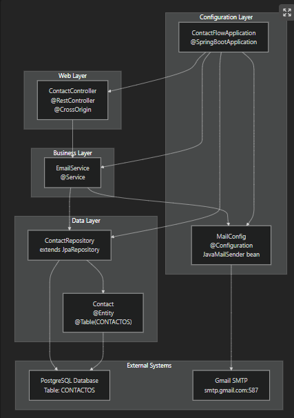
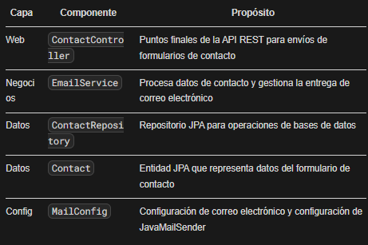
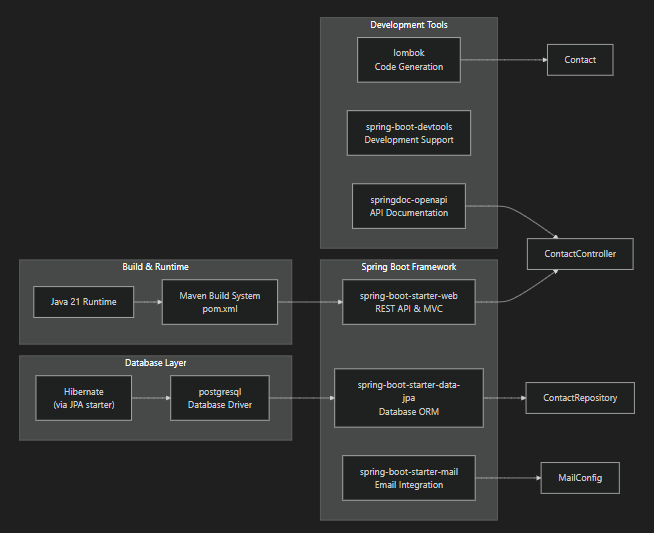
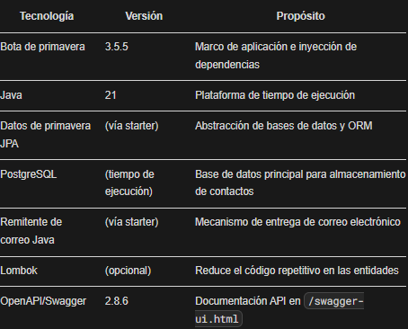
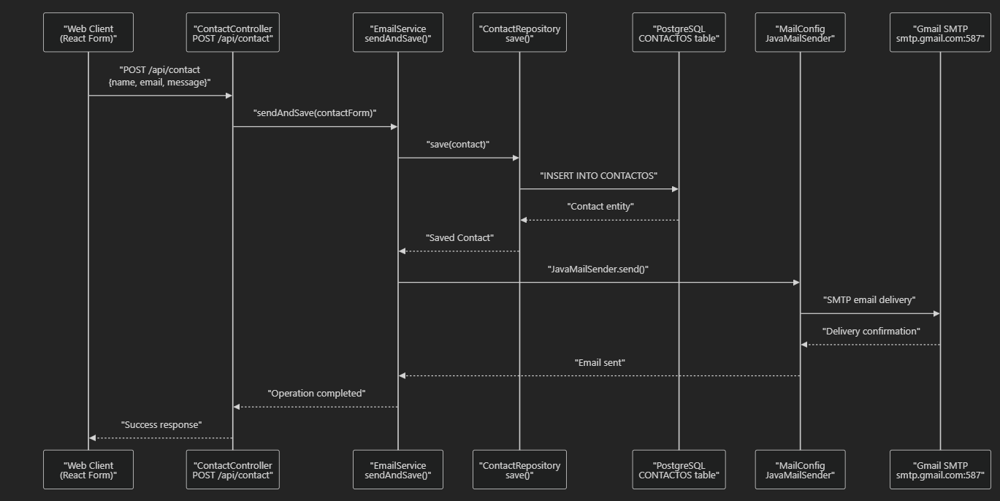
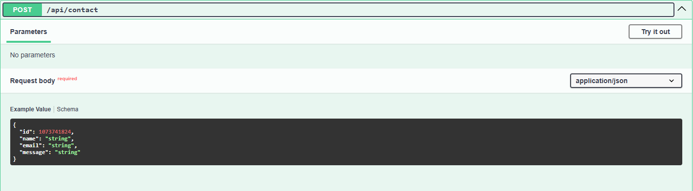

# ContactFlow
Web application built with Spring Boot that allows you to receive contact messages from a React form and send them directly to an email. Includes management of REST APIs, data validation and sending emails through JavaMailSender. Ideal for integrating contact forms into client websites or web applications.

# Propósito y alcance
Este documento proporciona una descripción general de alto nivel de ContactFlow, una aplicación Spring Boot que procesa
los envíos de formularios de contacto de clientes web y los envía por correo electrónico. ContactFlow sirve como un servicio
de middleware que conecta aplicaciones web (principalmente formularios React) con sistemas de entrega de correo electrónico
mientras conserva los datos de contacto en una base de datos PostgreSQL.

Esta página cubre la arquitectura general del sistema, los componentes principales y 
los patrones de integración. Para obtener información de configuración detallada,
consulte Configuración de la aplicación. Para conocer los puntos finales y el uso específicos 
de la API, consulte Capa API REST. Para conocer los procedimientos de compilación e implementación,
consulte Construcción e implementación.

# Propósito del sistema

ContactFlow está diseñado como un servicio de procesamiento de formularios de contacto con las siguientes funciones principales:

- Procesamiento de formularios de contacto: Acepta envíos de contactos a través de puntos finales de API REST
- Persistencia de los datos: Almacena información de contacto en una base de datos PostgreSQL
- Notificaciones por correo electrónico: Envía notificaciones por correo electrónico mediante la integración SMTP de Gmail
- Integración entre orígenes: Permite la integración con aplicaciones web externas y formularios React

El sistema implementa una arquitectura en capas limpia siguiendo las convenciones de Spring Boot para mayor mantenibilidad y escalabilidad.

# Arquitectura de la aplicación principal
El siguiente diagrama muestra los principales componentes de la aplicación y sus relaciones utilizando nombres de entidades de código reales:

# Componentes principales de la aplicación

El sistema está organizado en capas distintas con una clara separación de preocupaciones:

# Pila de tecnología
ContactFlow se basa en Spring Boot 3.5.5 con las siguientes dependencias e integraciones clave:

# Opciones tecnológicas clave

# Flujo de datos de procesamiento de contactos
Este diagrama ilustra el flujo completo del envío de un formulario de contacto utilizando nombres de métodos y clases reales:

# Pasos de procesamiento

+ Solicitar recepción: ContactController recibe solicitudes POST en /api/contact punto final

+ Lógica empresarial: EmailService.sendAndSave() El método maneja responsabilidades duales
+ Persistencia de los datos: ContactRepository.save() persiste el contacto con CONTACTOS tabla
+ Entrega por correo electrónico: JavaMailSender configurado por MailConfig envía notificación a través de Gmail SMTP
+ Respuesta: Confirmación de éxito devuelta al cliente

# Capacidades de integración
 ContactFlow está diseñado para la integración de origen cruzado con aplicaciones web externas:

+ Soporte CORS: Habilita solicitudes de diferentes dominios (aplicaciones React)
+ API REST: Puntos finales HTTP estándar para el envío de formularios de contacto
+ Documentación de OpenAPI: Documentación API interactiva disponible en https://contactflow.onrender.com/swagger-ui/index.html#
+ Configuración del entorno: Configuración externalizada vía application.properties
+ El sistema se puede integrar en sitios web existentes o utilizarse como un servicio de procesamiento de contactos independiente para múltiples aplicaciones cliente.